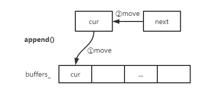
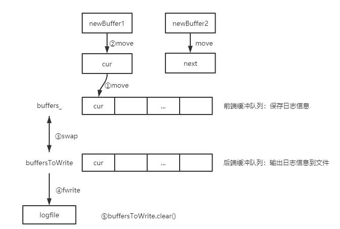

# 日志

**在Linux下很少使用GDB来调试错误**，开发过程中，会出现编译错误和运行错误

- 开发过程中：
  - 使用日志便于调试错误，如记录errno
  - 能更好的理解程序执行逻辑
- 运行过程中：
  - 诊断系统故障并处理
  - 记录系统运行状态


# LogStream.h

- 作用：
  - 实现了**存放日志数据**的FixBuffer类
  - 实现**C++输出风格**的日志流LogStream类

- 一些成员变量

|               变量               |                             描述                             |
| :------------------------------: | :----------------------------------------------------------: |
|          Buffer buffer_          | `typedef detail::FixedBuffer<detail::kSmallBuffer> Buffer`；日志缓冲区对象 |
| static const int kMaxNumericSize |                        默认缓冲区大小                        |

- 一些成员函数

|                    函数                    |                             描述                             |
| :----------------------------------------: | :----------------------------------------------------------: |
|    **LogStream& operator<<(POD value)**    | 一系列重载<<输出运算符，参数为常见POD类型；与`std::cout<<`输出到控制台不同，`LogStream`对象使用`<<`后，会把数据保存到`_buffer`中 |
| **LogStream& operator<<(const char* str)** |          调用**buffer_.append()**添加字符串常量str           |
|   void append(const char* data, int len)   |          调用**buffer_.append()**添加指定长度的data          |
|        const Buffer& buffer() const        |                       返回buffer_对象                        |
|             void resetBuffer()             |                     调用buffer_.reset()                      |
|           void formatInteger(T)            |                将int转换为字符串存放到buffer_                |

## FixedBuffer类

- 成员变量

  |       变量       |                        描述                        |
  | :--------------: | :------------------------------------------------: |
  | char data_[SIZE] |               缓冲区，SIZE为模板参数               |
  |    char* cur_    | 缓冲区指针，表示当前位置，可用于计算缓冲区实际长度 |

- 一些成员函数

  |                     函数                     |                  描述                  |
  | :------------------------------------------: | :------------------------------------: |
  | **void append(const char* buf, size_t len)** | 将buf数据复制到cur_中，并增加len个长度 |
  |                 int length()                 |          返回缓冲区字符串长度          |
  |              int avail() const               |           缓冲区当前可用空间           |
  |             void add(size_t len)             |        将cur_指针移动len个长度         |
  |                 void reset()                 |           重置cur\_为data\_            |
  |           const char* end() const            |            返回缓冲区尾指针            |


# Logging.h

作用：

- Logger日志类，暴露给用户使用的类：用户实质上**调用构造函数宏**来输出日志
- 包含枚举类型LogLevel日志级别
- 包含SourceFile日志文件类：封装和管理日志文件的两个属性（文件名，文件名长度）
- **包含Impl日志具体类**：封装日志的相关信息，**Logger的构造函数内部调用Impl的构造函数进行列表初始化**
- Logger对象构造函数的宏：方便用户调用

==**日志调用时序：**==Logger→Impl→LogStream→operator<<FixedBuffer→g_output→g_flush

## Logger类

- 成员变量

  |       变量       |       描述       |
  | :--------------: | :--------------: |
  |  enum LogLevel   |     日志级别     |
  | class SourceFile |    日志文件类    |
  |    class Impl    |    日志具体类    |
  |  **Impl impl_**  | **日志具体对象** |

- 一些成员函数

  |                  函数                   |                             描述                             |
  | :-------------------------------------: | :----------------------------------------------------------: |
  |  **Logger(SourceFile file, int line)**  |                      一系列有参构造函数                      |
  |         **LogStream& stream()**         |                返回impl\_.stream\_日志流对象                 |
  |       static LogLevel logLevel()        |                       返回全局日志级别                       |
  | static void setLogLevel(LogLevel level) |                       设置全局日志级别                       |
  |    static void setOutput(OutputFunc)    |                  **设置输出日志的回调函数**                  |
  |     static void setFlush(FlushFunc)     |                  **设置刷新日志的回调函数**                  |
  |              **~Logger()**              | 调用_impl.finish()；执行输出回调函数，输出日志到文件\标准输出 |

## LogLevel日志级别

| 日志级别 |                             描述                             |
| :------: | :----------------------------------------------------------: |
|  TRACE   |     指出比DEBUG粒度更细的一些信息事件（开发过程中使用）      |
|  DEBUG   |      指出细粒度消息事件来调试应用程序（开发过程中使用）      |
|   INFO   | 表明消息在粗粒度级别上突出强调应用程序的运行过程（**优先级大于前两个，TRACE\DEBUG不会输出**） |
|   WARN   |          系统能正常运行，但可能会出现潜在错误的情形          |
|  ERROR   |          指出虽然发生错误事件，但仍然不影响系统运行          |
|  FATAL   |            指出严重的错误事件，将会导致程序的退出            |

## Impl类

- 成员变量

  |         变量         |                         描述                          |
  | :------------------: | :---------------------------------------------------: |
  |   Timestamp time_    |                       日志时间                        |
  |  LogStream stream_   | 日志流对象，，可以使用>>将数据保存到FixedBuffer对象中 |
  |   LogLevel level_    |                       日志级别                        |
  |      int line_       |                        所在行                         |
  | SourceFile basename_ |                      日志文件名                       |

- 一些成员函数

  |                             函数                             |                  描述                  |
  | :----------------------------------------------------------: | :------------------------------------: |
  | Impl(LogLevel level, int old_errno, const SourceFile& file, int line) |              格式化日志行              |
  |                      void formatTime()                       |              格式化时间戳              |
  |                        void finish()                         | 输出日志文件名、调用日志的行号、换行符 |


# AsyncLogging.h

- 作用：
  - **双缓冲异步日志**
  - 使用**LogFile对象**来输出**滚动日志**

- 成员变量

  |                             变量                             |              描述              |
  | :----------------------------------------------------------: | :----------------------------: |
  |                   const int flushInterval_                   |       刷新异步日志的间隔       |
  |                 std::atomic\<bool\> running_                 | 原子bool类型，是否运行异步线程 |
  |                    const string basename_                    |           日志文件名           |
  |                    muduo::Thread thread_                     |          异步日志线程          |
  |                 muduo::CountDownLatch latch_                 |              门限              |
  |                   muduo::MutexLock mutex_                    |          缓冲区互斥锁          |
  |                    muduo::Condition cond_                    |         缓冲区条件变量         |
  |                    const off_t rollSize_                     |          日志滚动大小          |
  | typedef muduo::detail::FixedBuffer\<muduo::detail::kLargeBuffer> Buffer |             缓冲区             |
  | typedef std::vector\<std::unique_ptr\<Buffer>> BufferVector  |   存放缓冲区智能指针的vector   |
  |          typedef BufferVector::value_type BufferPtr          |        指向缓冲区的指针        |
  |                 **BufferPtr currentBuffer_**                 |  vecor中指向当前Buffer的指针   |
  |                  **BufferPtr nextBuffer_**                   | vector中指向下一个Buffer的指针 |
  |                  **BufferVector buffers_**                   |     存放Buffer指针的vector     |

- 一些成员函数

  |                     函数                      |        描述        |
  | :-------------------------------------------: | :----------------: |
  | **void append(const char* logline, int len)** |    添加日志信息    |
  |                 void start()                  | 创建并运行日志线程 |
  |                  void stop()                  |    停止运行线程    |
  |             **void threadFunc()**             |  异步日志线程函数  |

> void append()
>
> 

```c++
/******************************************************************** 
Description : 
前端在生成一条日志消息时，会调用AsyncLogging::append()。
如果currentBuffer_够用，就把日志内容写入到currentBuffer_中，
如果不够用(就认为其满了)，就把currentBuffer_放到已满buffer数组中，
等待消费者线程（即后台线程）来取。则将预备好的另一块缓冲
（nextBuffer_）移用为当前缓冲区（currentBuffer_）
*********************************************************************/
void AsyncLogger::append(const char *logline, size_t len)
{
    MutexLockGuard lock(mutex_); //保护缓冲区和缓冲队列
    // 如果当前buffer的长度大于要添加的日志记录的长度，即当前buffer还有空间，就添加到当前日志。
    if (currentBuffer_->avail() > len)
    {
        currentBuffer_->append(logline, len);
    }
    // 当前buffer已满，使用另外的缓冲区
    else
    {
        //1、先将currentBuffer_保存到缓冲区队列中
        buffers_.push_back(std::move(currentBuffer_));
        //2、如果另一块缓冲区不为空，则将预备好的另一块缓冲区移用为当前缓冲区
        if (nextBuffer_)
        {
            currentBuffer_ = std::move(nextBuffer_);
        }
        //如果前端写入速度太快了，一下子把两块缓冲都用完了，那么只好分配一块新的buffer，作当前缓冲区
        else
        {
            currentBuffer_.reset(new Buffer); // Rarely happens
        }
        //3、添加日志记录
        currentBuffer_->append(logline, len);
        //4、通知后端开始写入日志数据
        cond_.notify_one();
    }
}
```

> void threadFunc()：**双缓冲机制实现异步日志**
>
> 

```c++
/******************************************************************** 
Description : 
如果buffers_为空，使用条件变量等待条件满足（即前端线程把一个已经满了
的buffer放到了buffers_中或者超时）。将当前缓冲区放到buffers_数组中。
更新当前缓冲区（currentBuffer_）和另一个缓冲区（nextBuffer_）。
将bufferToWrite和buffers_进行swap。这就完成了将写了日志记录的buffer
从前端线程到后端线程的转变。
*********************************************************************/
void AsyncLogger::threadFunc()
{
    assert(running_ == true);
    latch_.countDown();
    //日志文件对象
  	LogFile output(basename_, rollSize_, false);
    //定义两个Buffer指针
    BufferPtr newBuffer1(new Buffer);
    BufferPtr newBuffer2(new Buffer);
    // 写入日志记录文件的缓冲队列
    BufferVector buffersToWrite;
    buffersToWrite.reserve(16);

    while (running_)
    {
        assert(newBuffer1 && newBuffer1->size() == 0);
        assert(newBuffer2 && newBuffer2->size() == 0);
        assert(buffersToWrite.empty());

        {
            //写缓冲区时，需要加锁
            muduo::MutexLockGuard lock(mutex_);
            // 如果buffers_为空，那么表示没有日志数据需要写入文件，那么就等待指定的时间
            if (buffers_.empty())  // unusual usage!
            {
                cond_.waitForSeconds(flushInterval_);
            }
            // 无论cond是因何（一是超时，二是当前缓冲区写满了）而醒来，都要将currentBuffer_放到buffers_中。
            // 如果是因为时间到（3秒）而醒，那么currentBuffer_还没满，此时也要将之写入LogFile中。
            // 如果已经有一个前端buffer满了，那么在前端线程中就已经把一个前端buffer放到buffers_中了
            // 此时，还是需要把currentBuffer_放到buffers_中（注意，前后放置是不同的buffer，
            // 因为在前端线程中，currentBuffer_已经被换成nextBuffer_指向的buffer了）。
            buffers_.push_back(std::move(currentBuffer_));
            // 将新的buffer（newBuffer1）移用为当前缓冲区（currentBuffer_）
            currentBuffer_ = std::move(newBuffer1);
            // buffers_和buffersToWrite交换数据
            // 此时buffers_所有的数据存放在buffersToWrite，而buffers_变为空
            buffersToWrite.swap(buffers_);
            // 如果nextBuffer_为空，将新的buffer（newBuffer2）移用为另一个缓冲区（nextBuffer_）
            if (!nextBuffer_)
            {
                nextBuffer_ = std::move(newBuffer2);
            }
        }
        assert(!buffersToWrite.empty());
        // 如果将要写入文件的buffer列表中buffer的个数大于25，那么将多余数据删除。
        // 前端陷入死循环，拼命发送日志消息，超过后端的处理能力，这是典型的生产速度超过消费速度，
        // 会造成数据在内存中的堆积，严重时引发性能问题(可用内存不足)或程序崩溃(分配内存失败)。
        if (buffersToWrite.size() > 25)
        {
            char buf[256];
            snprintf(buf, sizeof buf, "Dropped log messages at %s, %zd larger buffers\n",Timestamp::now().toFormattedString().c_str(),buffersToWrite.size()-2);
            fputs(buf, stderr);
            output.append(buf, static_cast<int>(strlen(buf)));
            buffersToWrite.erase(buffersToWrite.begin()+2, buffersToWrite.end());
        }
        // 将buffersToWrite的数据写入到日志文件中
        for (const auto& buffer : buffersToWrite)
        {
          // FIXME: use unbuffered stdio FILE ? or use ::writev ?
            output.append(buffer->data(), buffer->length());
        }
        // 重新调整buffersToWrite的大小
        if (buffersToWrite.size() > 2)
        {
            buffersToWrite.resize(2);
        }
        // 从buffersToWrite中弹出一个作为newBuffer1 
        if (!newBuffer1)
        {
            assert(!buffersToWrite.empty());
            newBuffer1 = std::move(buffersToWrite.back());
            buffersToWrite.pop_back();
            newBuffer1->reset();
        }
        // 从buffersToWrite中弹出一个作为newBuffer2
        if (!newBuffer2)
        {
            assert(!buffersToWrite.empty());
            newBuffer2 = std::move(buffersToWrite.back());
            buffersToWrite.pop_back();
            newBuffer2->reset();
        }
        // 清空buffersToWrite
        buffersToWrite.clear();
        output.flush();
    }
    output.flush();
}
```


# LogFile.h


# 测试用例

> 同步日志
>
> 日志默认打印到stdout；增加outputFunc可以将日志输出到文件；命令行可以指定输出的日志文件名

```c++
#include <unistd.h>
#include <errno.h>
#include <muduo/base/LogFile.h>
#include <muduo/base/Logging.h>

using namespace muduo;

std::unique_ptr<muduo::LogFile> g_logFile;

void outputFunc(const char *msg, int len)
{
    g_logFile->append(msg, len);
}

void flushFunc()
{
    g_logFile->flush();
}

int main(int argc, char const *argv[])
{
    char name[256] = {'\0'};
    strncpy(name, argv[0], sizeof name - 1);
    g_logFile.reset(new LogFile(::basename(name), 200 * 1000));
    Logger::setOutput(outputFunc);
    Logger::setFlush(flushFunc);
    LOG_DEBUG << "debug";
    LOG_INFO << "Hello";
    LOG_TRACE << "trace";
    LOG_WARN << "World";
    LOG_ERROR << "Error";
    errno = 13;
    LOG_SYSERR << "SYSERR";
    return 0;
}
```

