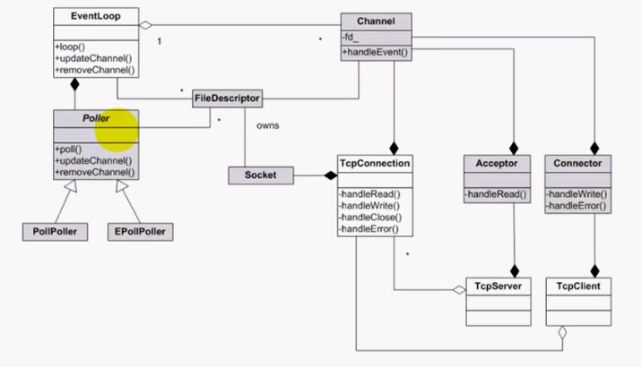
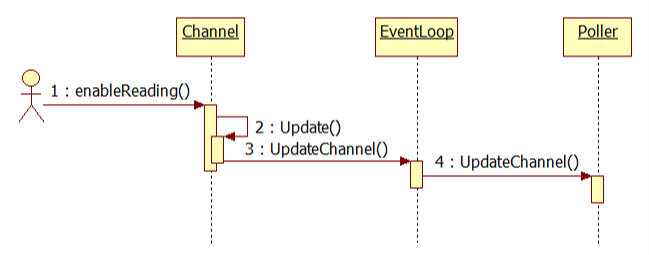

# 关系及时序图




- 1：调用EventLoop::loop()
- 2：EventLoop包含一个**Poller对象**，和一个Channel**活动通道数组activeChannels**，**loop()实质上是调用Poller::poll()**
- 3：Poller是一个抽象类（子类PollPoller、EPollPoller），包含一个Channel对象，当检测到一些文件描述符发生I/O事件时，先实现**Poller::poll()等待IO事件**，当有事件发生时，内部调用**fillActiveChannels()**把**已发生的IO事件保存到activeChannels中**
- 4：EventLoop获得活动通道数组activeChannels
- 5：循环调用activeChannels每个Channel的**handleEvent()来调用注册的回调函数处理I/O事件**
- 6：EventLoop可以包含多个Channel，也可以调用ChannelB的handleEvent()处理I/O事件
- 7：事件循环，再次调用EventLoop::loop()


# EventLoop

- EventLoop实质上是**Reactor模式(poll/epoll工作流程)的封装**
- one loop per thread：指==每个线程==**最多只能有一个EventLoop对象**
- EventLoop构造函数会记住当前对象所属的线程（threadId_）
- EventLoop构造函数还会检测当前线程是否已经存在了一个EventLoop实例，遇到错误就报错（LOG_FATAL）
- 包含了一个**TimerQueue定时器队列**，用于设置一些定时事件（ **runInLoop()、runAt()、runAfter()、runEvery()、cancel()**）
- **创建了EventLoop对象的线程称为IO线程，其功能是运行事件循环（`EventLoop::loop()`）**
- ==EventLoop是暴露给用户使用的类==

**loop()**：内部调用Poll::loop()，监听可读可写事件

**updateChannel()**：内部调用Poll::updateChannel，更新事件

**removeChannel**：内部调用Poll::removeChannel，移除事件

> class EventLoop简化版

```c++
#ifndef EVENTLOOP_H
#define EVENTLOOP_H

#include <boost/noncopyable.hpp>
#include <muduo/base/CurrentThread.h>
#include <muduo/base/Logging.h>
#include <pthread.h>
#include <sys/poll.h>

using namespace muduo;
//using namespace muduo::net;

class EventLoop : boost::noncopyable
{
public:
    EventLoop();
    ~EventLoop();
    void loop();
    void assertInLoopThread()
    {
        if (!isInLoopThread())
        {
            abortNotInLoopThread();
        }
    }
    bool isInLoopThread() const { return threadId_ == CurrentThread::tid(); };
    static EventLoop *getEventLoopOfCurrentThread();
private:
    void abortNotInLoopThread();
private:
    bool looping_;
    const pid_t threadId_;
};

#endif // EVENTLOOP_H
```

```c++
#include "EventLoop.h"

namespace
{
    //当前线程的局部存储，即线程私有变量
    __thread EventLoop *t_loopInThisThread = 0;
} // namespace

EventLoop* EventLoop::getEventLoopOfCurrentThread()
{
    return t_loopInThisThread;
}

EventLoop::EventLoop() : looping_(false), threadId_(CurrentThread::tid())
{
    LOG_DEBUG << "EventLoop created " << this << " in thread " << threadId_;
    //检查当前线程是否已经存在EventLoop对象
    if (t_loopInThisThread)
    {
        LOG_FATAL << "Another EventLoop " << t_loopInThisThread
                  << " exists in this thread " << threadId_;
    }
    else
    {
        t_loopInThisThread = this;
    }
}

EventLoop::~EventLoop()
{
    t_loopInThisThread = NULL;
}

//事件循环，该函数不能跨线程调用，只能在当前线程中使用
void EventLoop::loop()
{
    assert(!looping_);
    assertInLoopThread();
    looping_ = true;
    LOG_TRACE << "EventLoop " << this << " start looping";

    //IO复用流程；完整版中，先调用poller->pool()，再使用Channel处理IO事件
    ::poll(NULL, 0, 5 * 1000);

    looping_ = false;
}
```


# Poller

- 一个EventLoop包含一个Poller对象，是组合关系
- Poller对象的生存期由EventLoop控制
- **面向对象思想**，实现PollPoller和EPollPoller；为用户提供虚函数接口，实现多态

**poll()：**监听IO事件，如poll()、epoll_wait()；当有事件发生时，调用fillActiveChannels()

**fillActiveChannels()：**循环所有事件，把事件结构体指针转为Channel，加入到activeChannels中

**updateChannel**：更新事件变化，内部调用update进行具体操作

**removeChannel**：移除事件，内部调用update进行具体操作

**update**：调用epoll_ctl

```c++
Timestamp EPollPoller::poll(int timeoutMs, ChannelList* activeChannels)
{
    //epoll_wait等待IO事件
  int numEvents = ::epoll_wait(epollfd_,
                               &*events_.begin(),
                               static_cast<int>(events_.size()),
                               timeoutMs);
  if (numEvents > 0)
  {
      //获得活动通道
    fillActiveChannels(numEvents, activeChannels);
  }
}

void EPollPoller::fillActiveChannels(int numEvents,
                                     ChannelList* activeChannels) const
{
  for (int i = 0; i < numEvents; ++i)
  {
      //ptr转换为Channel*
    Channel* channel = static_cast<Channel*>(events_[i].data.ptr);
#ifndef NDEBUG
    int fd = channel->fd();
    ChannelMap::const_iterator it = channels_.find(fd);
    assert(it != channels_.end());
    assert(it->second == channel);
#endif
    channel->set_revents(events_[i].events);
      //添加通道
    activeChannels->push_back(channel);
  }
}
```


# Channel

- ==I/O事件的注册与响应的封装==
- 一个EventLoop包含多个Channel，即可以获取多个I/O事件，是聚合关系；一个Channel只能位于一个EventLoop，**构造函数Channel(EventLoop* loop, int fd)，指定所在事件循环和I/O事件的文件描述符**
- Channel是Accepter、Connector、EventLoop（管理唤醒Channel）、TimerQueue、TcpC ·onnection的成员，生命期由这些控制
- 使用基于对象的思想，注册I/O事件相应的回调函数

**update()**：注册I/O可读或可写事件

**handleEvent()**：处理I/O事件

**setxxxCallback()**：设置回调函数；在业务类的构造函数中调用该函数

**enableReading()**：关注文件描述符的**可读事件**，内部最终是调用Poller::UpdateChannel()



# Accepter

被动连接的抽象


# Connector

主动连接的抽象


# TcpConnection

已连接套接字的抽象
